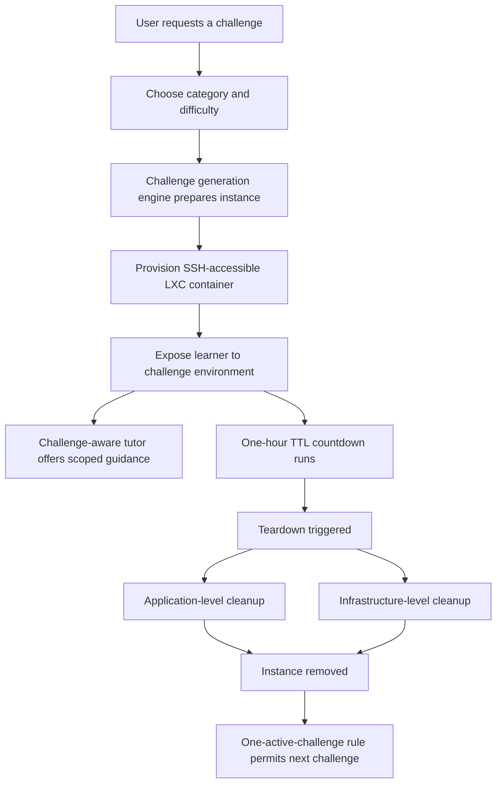
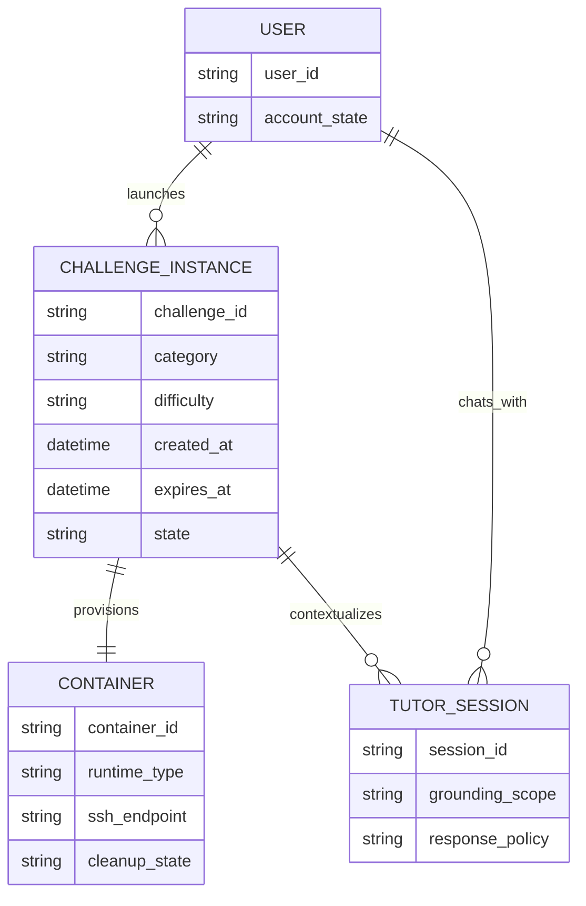

# Background Literature and Platform Comparison for VulnForge

## Executive summary

The literature gives me a strong basis for arguing that hands-on cybersecurity training is not a pedagogical luxury but a core requirement. Capture-the-Flag exercises and lab-based environments complement lecture-led teaching by turning abstract concepts into situated practice, and prior work shows that CTF-style activities can function as meaningful formative assessment as well as motivation-enhancing learning experiences. At the same time, the same literature cautions that CTFs tend to overemphasize technical exploitation tasks unless they are deliberately broadened, and that realistic cyber-range style environments introduce cost, orchestration, and safety burdens that simpler training artifacts avoid. citeturn22search2turn18search3turn36view0turn19view0turn17search1

Against that background, the comparison platforms occupy distinct design positions. OWASP Juice Shop offers a deliberately vulnerable but fixed application with a large challenge set, tutorials, mitigation links, coding challenges, and CTF tooling. PortSwigger’s Web Security Academy offers a curated, research-led, constantly updated web-security corpus with interactive labs and strong progression scaffolding; notably, PortSwigger also states that it serves “hundreds of thousands of custom generated legally-hackable websites each month,” so it is not accurate to describe PortSwigger as purely static. Hack The Box Academy and TryHackMe provide large curated ecosystems of paths, modules, rooms, target systems, timers, and progress mechanisms, with HTB leaning more toward structured practitioner development and TryHackMe leaning more toward beginner-friendly guided learning at scale. citeturn33view2turn33view3turn15view0turn15view2turn24view1turn24view0turn16view0turn24view2turn25view0turn24view4turn24view5turn26view0turn26view1

I therefore position VulnForge most convincingly not as a platform that already surpasses these ecosystems in content breadth, community, or institutional maturity, but as a platform that optimizes a different point in the design space: prompt-specified on-demand challenge generation, constrained variability across five vulnerability categories and three difficulty levels, SSH-accessible LXC isolation, a hard one-hour time-to-live, dual-layer cleanup, a challenge-aware tutor, and a one-active-challenge rule. Relative to the comparators, those choices give me stronger arguments around controlled variability, focused learner flow, and explicit operational containment. They do not, however, remove the need for validation of generated challenge quality, nor do they overcome the structural advantages that mature platforms have in content volume, certification, analytics, and community support. The AI literature is especially important here: code-generation systems can emit insecure code, users can become overconfident when assisted by AI, and even retrieval-augmented tutors still produce some incorrect or out-of-context answers, so any claim I make for VulnForge’s tutor or generation pipeline has to be bounded by those risks. citeturn9view0turn9view1turn27view1turn28view4turn30view0turn32search5turn31search1

## Scope and assumptions

This report is written in the first person because I am positioning my own project, VulnForge, within a dissertation background chapter. I assume the principal audience is higher-education learners or self-directed trainees rather than blue-team enterprise cohorts, because the prompt-specified feature set emphasizes individual challenge creation, difficulty selection, a bounded one-hour lifecycle, and a one-active-challenge constraint. I also assume that the dissertation comparison is interested primarily in pedagogical fit, platform architecture, operational safety, and design trade-offs rather than in market adoption or revenue models.

A practical limitation matters. In this runtime I was not able to retrieve the attached repository through the available repository-search tooling, so I cannot supply line-level file citations for VulnForge itself. I therefore treat the VulnForge feature set named in the prompt as repository-grounded input for analysis: dynamic generation, five vulnerability categories, three difficulty levels, SSH-accessible LXC containers, one-hour TTL, dual-layer cleanup, a challenge-aware tutor, and a one-active-challenge constraint. Where I say that VulnForge has an “advantage,” I mean an advantage relative to the cited comparator features and the prompt-specified VulnForge design; where I say “not documented,” I mean that I did not find the feature described in the user-facing official sources reviewed here.

## Pedagogical rationale for hands-on training and CTFs

The strongest educational argument for VulnForge begins with the fact that hands-on practice is already well established as central to cybersecurity learning. Švábenský et al. describe CTFs as a “popular form of modern hands-on cybersecurity education,” show that they complement traditional teaching formats, and analyze 15,963 written solutions to map the knowledge and skills they actually exercise. Their core conclusion is useful for a dissertation chapter because it is balanced: CTFs are valuable and engaging, but they disproportionately emphasize technical areas such as cryptography and network security while underrepresenting human and awareness-oriented skills. That means a hands-on platform is pedagogically justified, but also that its scope needs to be described honestly. citeturn22search2turn22search0

Chothia and Novakovic offer a second important point for my argument: CTF-style challenges can function as part of assessed academic learning rather than merely as extracurricular games. Their study of an offline VM-based CTF framework reports that challenge performance was analyzed alongside more traditional written answers and examinations, specifically to examine whether CTFs are effective as an assessment tool in academic cybersecurity courses. This helps me argue that a platform such as VulnForge is not only motivationally useful but educationally defensible when integrated into formal teaching. citeturn18search3turn18search0

NIST’s cyber-range guidance sharpens the point further by framing simulated environments as safe, legal spaces for gaining hands-on cyber skills, performing performance-based learning and assessment, receiving real-time feedback, and simulating on-the-job experience. That matters because it shifts the rationale away from “gamification for its own sake” and toward guided rehearsal in controlled environments. In that light, the prompt-specified VulnForge design makes pedagogical sense: category selection and three difficulty levels support scaffolding; SSH access supports authentic interaction rather than passive multiple-choice work; and a challenge-aware tutor potentially reduces the gap between learner effort and formative feedback. citeturn36view0turn19view0

At the same time, the literature suggests a careful limitation I should state explicitly in the dissertation. A platform like VulnForge, if centered on exploit-oriented challenge instances, will likely inherit the same partiality identified in CTF research unless I deliberately extend it toward mitigation, reflection, or defensive reasoning. In other words, hands-on exploitation is pedagogically strong, but it is not synonymous with complete cybersecurity education. That is one reason why comparator platforms that combine labs with explanations, paths, mitigation guidance, and structured curricula still matter in this chapter. citeturn22search2turn33view3turn24view0turn24view4

## Cyber ranges and their design trade-offs

NIST defines cyber ranges as interactive, simulated representations of networks, systems, tools, and applications connected to a simulated Internet-level environment; it emphasizes that they provide a safe, legal environment for hands-on cyber skills and can support assessment, teamwork, real-time feedback, experimentation, and on-the-job simulation. The cyber-range literature broadens that picture by showing that the central design problem is not simply “realism,” but realism under constraints: architecture, orchestration, pedagogy, cost, evaluation, and safety all interact. Katsantonis et al. argue that cyber ranges suffer from a lack of standards and common methodologies, while also facing high organizational demands and running costs; their Cyber Range Design Framework explicitly tries to optimize impact while minimizing preparation and operational burdens. A more recent taxonomy review likewise argues that prior taxonomies focused heavily on scenarios and functions, and that technology itself now deserves its own explicit dimension because orchestration, automation, virtualization, and related infrastructure have become inseparable from capability. citeturn36view0turn19view0turn5search1

That literature makes the trade-offs I need for VulnForge quite clear. At one extreme are richer multi-host or institution-scale cyber ranges, which can support teamwork, role-based exercises, realistic network topologies, and stronger assessment models. At the other extreme are lighter-weight challenge environments that are easier to provision, reset, and contain. Survey work on open-source CTF environments found that platforms often share similar base functionality while differing substantially in configuration, and PocketCTF notes that deploying suitable digital environments for exercises can be difficult and resource-intensive for educators. This supports an important analytical claim: training platforms are differentiated as much by their lifecycle and orchestration choices as by their challenge content. citeturn17search1turn4search4turn19view0

In that design space, I would characterize VulnForge as a cyber-range-lite architecture. The prompt-specified one-active-challenge rule, one-hour TTL, LXC isolation, and dual-layer cleanup indicate that I have optimized toward bounded single-user practice rather than toward maximal environment fidelity. That gives me a credible positive argument: compared with a heavier cyber range, VulnForge should be easier to reason about operationally, cheaper to govern, and simpler to keep safe. But the corresponding limitation is equally important: I should not oversell VulnForge as a substitute for richer range scenarios involving multi-host lateral movement, blue-team telemetry, sustained team coordination, or formal KSA-aligned analytics. That limitation follows directly from the literature on what mature cyber ranges are expected to support. citeturn36view0turn19view0turn20search0

*Conceptual lifecycle reconstruction from the prompt-specified VulnForge design.*

## Platform comparisons and analytical positioning

The table below summarizes the main platform differences that matter for a dissertation background chapter. For the commercial platforms, I use only the official user-facing sources reviewed here. Where a cell says “not documented,” I mean not documented in those official sources.

| Feature | OWASP Juice Shop | PortSwigger Web Security Academy | HTB Academy | TryHackMe | VulnForge |
|---|---|---|---|---|---|
| Core model | Deliberately vulnerable web application with fixed challenge set | Curated topic-led learning materials and labs | Curated modules and paths with target systems | Curated rooms, modules, and learning paths | On-demand generated challenge instances |
| Content dynamism | Fixed corpus, though deployable/resettable | Custom-generated lab sites from curated topics | Spawned targets from fixed modules | Spawned task machines from fixed rooms | Generated per request |
| Learner-selected category/difficulty at creation | Challenge difficulties exist, but no per-request generation | Topic and path selection, not user-driven challenge generation | Module/path/tier selection, not per-request generation | Room/path selection, not per-request generation | Yes: five categories and three difficulty levels |
| Typical interaction mode | Browser against vulnerable app | Browser plus web-security tooling | Browser/Pwnbox plus Docker or VM targets, sometimes SSH/RDP | Browser plus AttackBox/VPN and task machines | SSH into LXC container |
| Built-in learner guidance | Tutorials, scoreboard, mitigation links, coding challenges | Learning materials, learning paths, progress tracking | Reading, hints, skills assessments, optional solutions | Walkthrough rooms, challenge rooms, learning paths | Challenge-aware tutor |
| Time-bound lifecycle | Self-healing on server startup; no per-instance timer documented | Not documented in user-facing Academy docs reviewed | Target systems can be reset, extended, or terminated | Task machines show an expiry timer and can be terminated | One-hour TTL |
| Cleanup posture | Reset/repopulate behavior documented | Platform-managed security emphasized, user-facing cleanup controls not documented | Reset/extend/terminate controls | Expiry plus manual terminate | Dual-layer cleanup |
| Structured pathways | Limited compared with course platforms | Yes | Yes | Yes | Not specified in prompt |
| Documented scale | Large fixed challenge set plus 33 coding challenges | Many labs per topic and continually updated topics | Scores of modules and job-role paths | Over 750 rooms, 65 modules, 12 learning paths | Narrower current scope |

Table sources: OWASP Juice Shop official project pages and companion features; PortSwigger Academy official pages and engineering description; HTB Academy official FAQ and help docs; TryHackMe official help docs. For VulnForge, the entries reflect the prompt-specified feature set rather than directly retrievable repo files. citeturn33view2turn33view3turn15view0turn15view2turn24view1turn24view0turn16view0turn24view2turn25view0turn24view4turn24view5turn26view0turn26view1

Juice Shop is the fairest “static vulnerable app” comparator because it is both strong and transparent. Officially, it is a deliberately insecure web application spanning the OWASP Top Ten and other real-world flaws; it includes varied challenge difficulty, a scoreboard, tutorial guidance, mitigation links, coding challenges for 33 cases, self-healing reset behavior on startup, and CTF support through `juice-shop-ctf-cli`. Those are real strengths. For a dissertation, I should not caricature Juice Shop as simplistic or obsolete. Compared with that model, my strongest accurate advantage claim for VulnForge is not “more realistic” in the abstract, but rather **more variable and more strongly lifecycle-governed per learner session**: prompt-specified on-demand generation, category/difficulty selection, SSH-accessible isolated containers, a hard TTL, and dual cleanup. Those choices let me argue for individualized practice and stronger per-instance containment than a single fixed application typically provides. But VulnForge does **not** overcome Juice Shop’s polished challenge corpus, mature documentation, mitigation links, companion guide, or established community ecosystem. Juice Shop also has a pedagogical virtue that I should acknowledge: because its challenge set is stable and well documented, it is easier to teach from, benchmark, and reproduce across cohorts. citeturn33view2turn33view3turn15view0turn15view1turn15view2

PortSwigger’s Web Security Academy is best understood as a curated, research-led web-security curriculum rather than merely a lab host. PortSwigger states that the Academy is free, constantly updated, built around learning materials and interactive labs, and organized through learning paths and progress tracking. It also states, crucially, that the platform provides “hundreds of thousands of custom generated legally-hackable websites each month,” which means I should avoid claiming that VulnForge is uniquely dynamic in the entire comparison set. The stronger and more accurate contrast is this: **PortSwigger’s dynamism is in large-scale delivery of expertly curated web labs**, whereas **VulnForge’s claimed novelty is user-directed challenge generation with bounded isolated instances and a built-in tutor**. My advantages over PortSwigger therefore lie in per-user generation control, SSH-accessible containerized interaction, and a tighter operational envelope for each challenge. What I do **not** overcome are PortSwigger’s extraordinary subject depth, research freshness, topic breadth, pedagogical polish, certification ecosystem, and community visibility. In fact, if my dissertation claims that VulnForge is “better” than Web Security Academy in general, that would not be defensible; the defensible claim is that VulnForge optimizes a different educational niche. citeturn24view1turn24view0turn16view0

HTB Academy offers a different kind of strength: structured practitioner development. Officially, it organizes learning through modules, sections, and paths; uses hands-on checkpoints and skills assessments; offers browser-based Pwnbox interaction; supports Docker and VM targets; can provide credentials for SSH or RDP access; and lets users reset, extend, or terminate target systems. This is a mature guided-learning architecture. Relative to HTB, VulnForge’s clearest prompt-specified advantages are **immediacy of bespoke challenge creation**, **a stricter bounded lifecycle**, and **an integrated challenge-aware tutor rather than mostly fixed hints/solutions**. Those are positive differences, especially for dissertation arguments around personalized lab generation and resource control. However, HTB still dominates on breadth, path structure, notes, certifications, and overall maturity. I should also note a trade-off honestly: HTB’s extendable target duration is more flexible for longer exploratory work, whereas a hard one-hour TTL in VulnForge is safer and more bounded but can also prematurely constrain deeper investigation. citeturn24view2turn14view0turn25view0turn13view1

TryHackMe’s official help documentation highlights a large and highly curated beginner-to-expert learning ecosystem: over 750 rooms, 65 modules, and 12 learning paths; walkthrough rooms and challenge rooms; difficulty signaling from easy to insane; task machines with expiry timers and terminate controls; and room/task structures that can include virtual machines. Compared with TryHackMe, VulnForge’s accurate advantages again concern **generation and containment rather than catalog size**: on-demand challenge creation instead of selecting from a pre-authored room library, SSH-accessible isolated containers, a tighter one-active-challenge focus, and a challenge-aware tutor. Those characteristics could produce a cleaner experimental environment for short-form individualized practice. But VulnForge does not overcome TryHackMe’s content volume, beginner accessibility, platform polish, role/path scaffolding, or organizational customization features. Indeed, TryHackMe’s very scale is one of the strongest reasons it remains a better general-purpose learning platform even if VulnForge is the more interesting research prototype. citeturn24view4turn24view5turn26view0turn26view1turn3search1turn3search4

Taken together, the platform comparison suggests the most defensible dissertation position for me is this: **VulnForge is not yet a broader replacement for the established platforms, but a narrower platform innovation that combines on-demand generation, explicit infrastructure governance, and tutor-guided interaction in a way the comparators do not jointly offer.** That is a strong claim because it is specific. It is also balanced because it leaves intact the obvious strengths of the incumbents: mature curricula, stable corpora, certifications, analytics, community, and breadth. citeturn24view1turn25view0turn24view4turn33view3

## AI and LLM use in code generation and tutoring

The AI literature gives me both a rationale and a warning. On the code-generation side, Pearce et al. found that in 89 scenarios producing 1,689 programs, GitHub Copilot generated vulnerable code in approximately 40% of cases. Perry et al. then extended the concern from model behavior to user behavior: in their large-scale study, participants with access to an AI code assistant wrote significantly less secure code than those without it, and were more likely to believe their code was secure. For a dissertation chapter, these are high-value citations because they let me argue that any platform generating code or code-like challenge artifacts with AI must treat security validation as a first-class requirement, not as a downstream cleanup issue. citeturn9view0turn9view1

The tutoring literature is more mixed, but still useful. The SENSAI work shows the promise of context-aware LLM tutoring for applied cybersecurity by using learner context such as active terminals and edited files; the system reportedly improved efficiency and satisfaction at meaningful scale. At the same time, broader tutoring studies remain cautionary. A pilot higher-education retrieval-augmented tutor study found positive student and lecturer experiences, but still recorded 1.5% incorrect answers and 16.5% answers outside the supplied context. The educational RAG survey likewise identifies hallucination, outdated knowledge, and limited multimodality as persistent issues, while trustworthy-LLM review work emphasizes that hallucination and bias remain central trustworthiness problems requiring explicit mitigation. citeturn27view1turn28view4turn27view0turn30view0

This is precisely where the prompt-specified VulnForge tutor becomes analytically interesting. If the tutor is genuinely challenge-aware, then one accurate advantage I can claim over Juice Shop, PortSwigger, HTB, and TryHackMe is **adaptive contextual feedback that is coupled to the learner’s active instance**, rather than purely fixed walkthroughs, path text, hints, or static solutions. But the AI literature forces me to state the boundary conditions. A challenge-aware tutor is only a pedagogical asset if it is grounded tightly in challenge metadata and current task state, constrained against leaking complete solutions or flags, and evaluated for factual reliability. Likewise, if VulnForge uses AI in challenge generation, then solvability checking, sandboxed execution, human review of templates, and conventional secure-development practices remain mandatory. NIST’s SSDF and its AI-focused SP 800-218A are especially relevant here because they explicitly frame secure software development and AI-model development as processes requiring added practices, tasks, and risk-management controls. citeturn9view1turn28view4turn31search1turn32search5

So, in dissertation terms, AI is best framed not as a magical differentiator but as a **conditional accelerator**. It helps me explain why VulnForge can plausibly generate varied challenge experiences and deliver adaptive support. It also gives me an academically rigorous reason to discuss failure modes: insecure generated code, hallucinated hints, over-trusting learners, unsound challenge logic, and pedagogically harmful answer leakage. That balanced treatment will make the chapter more credible, not less ambitious. citeturn9view0turn9view1turn27view0turn30view0turn32search5

## Operational safety and infrastructure controls

Operational safety is the area where VulnForge’s design looks especially defensible. NIST’s Application Container Security Guide states that containers bring distinct security concerns and highlights relevant control families including access control, configuration management, identification and authentication, incident response, risk assessment, system and communications protection, and system integrity. PortSwigger’s own engineering page makes the same point in practice: its team explicitly says it must “juggle showing off vulnerable technologies, while ensuring that our platform remains secure,” and it describes Docker-based cloud infrastructure as part of how that is done. HTB Academy and TryHackMe expose user-visible lifecycle controls as well: HTB targets can be reset, extended, or terminated, while TryHackMe task machines show an expiry timer and can be terminated. Juice Shop, although not a full managed range, documents self-healing behavior in which the app is wiped and repopulated on server startup. citeturn38view0turn16view0turn25view0turn24view5turn33view1

This gives me a strong comparative claim for VulnForge. The prompt-specified one-hour TTL, dual-layer cleanup, and one-active-challenge rule amount to explicit governance mechanisms, not incidental conveniences. They should reduce the risk of abandoned instances, uncontrolled parallel resource growth, and long-lived vulnerable environments. Combined with SSH-accessible LXC containers, they also support a clean dissertation argument that VulnForge aligns with the literature’s emphasis on safe, legal, bounded practical environments. In that sense, VulnForge appears stronger than the static-app model and more explicit than some user-facing controls in curated platforms. The trade-off is that such strict containment also narrows the platform’s ambition: it does not, by itself, solve container escape risk, abuse of shell access, validation of generated challenge integrity, or the lack of broader analytics and team-exercise capability that fuller cyber ranges can provide. citeturn36view0turn19view0turn38view0

I would therefore conclude the chapter by positioning VulnForge as a bounded, individualized, AI-assisted training platform rather than as a universal cyber range. That positioning is academically strong because it is both ambitious and realistic. My comparative advantage is the **combination** of on-demand generation, explicit lifecycle control, isolated SSH-accessible instances, and adaptive tutoring. My non-overcome limitations are equally clear: narrower content breadth, smaller ecosystem, absent documented certification/community features, and the ongoing need for rigorous validation of AI-supported generation and guidance. Those are not weaknesses to hide; they are the exact trade-offs that make VulnForge a coherent dissertation project. citeturn24view1turn25view0turn24view4turn33view3turn30view0turn32search5

*Conceptual entity sketch for the prompt-specified VulnForge design.*